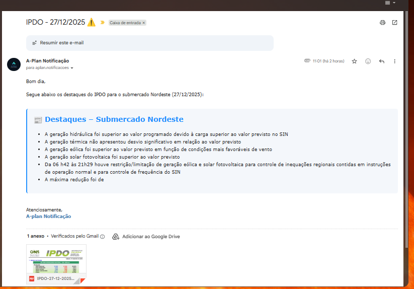
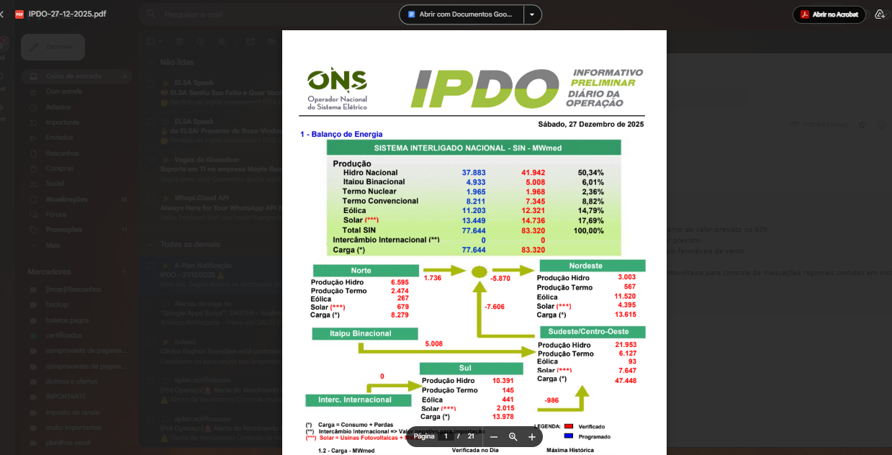

# 📊 Automação IPDO ONS — Notificação por E-mail

Este projeto implementa uma automação em Python responsável por:

- Acessar o site oficial do **ONS**
- Identificar e baixar automaticamente o **IPDO diário**
- Ler o PDF e extrair os **Destaques da Operação do Submercado Nordeste**
- Enviar um **e-mail HTML formatado**, com o resumo e o PDF anexado

Projeto desenvolvido com foco em **rotinas operacionais do setor elétrico**, RPA e automação de alertas.

---

## 🧩 Tecnologias utilizadas

- Python 3
- Requests (download do PDF)
- PyPDF (leitura e extração de texto)
- Regex avançado para parsing de conteúdo
- SMTP (envio de e-mail automático)
- HTML/CSS inline para formatação do e-mail

---

## 🔄 Fluxo da automação

1. Consulta o acervo digital do ONS
2. Baixa automaticamente o IPDO do dia anterior
3. Localiza a seção **"4 - Destaques da Operação"**
4. Extrai exclusivamente o trecho do **Submercado Nordeste**
5. Formata os destaques em HTML profissional
6. Envia e-mail com:
   - Resumo automático
   - PDF IPDO anexado

---

## 📧 Exemplo do e-mail recebido

---

## 📄 Exemplo do PDF IPDO

---

## ⚙️ Como executar

# ------------------------------
# RODA DIÁRIAMENTE COMO TAREFA NO pythonanywhere
# ------------------------------

import requests
import smtplib
from email.mime.multipart import MIMEMultipart
from email.mime.text import MIMEText
from email.mime.application import MIMEApplication
from datetime import datetime, timedelta
from pypdf import PdfReader
import io
import re
from io import BytesIO

# ------------------------------
# NORMALIZA TEXTO DO PDF
# ------------------------------
def normalizar_texto_pdf(txt):
    txt = txt.replace("\xad", "").replace("\u200b", "").replace("\ufeff", "")
    txt = re.sub(r"\s+", " ", txt)
    return txt.strip()

# ------------------------------
# FUNÇÃO ROBUSTA PARA ACHAR SEÇÃO
# ------------------------------
def extrair_destaques_formatado(pdf_bytes):

    reader = PdfReader(BytesIO(pdf_bytes))

    # Localiza a página com a seção 4
    pagina_alvo = None
    for i, page in enumerate(reader.pages):
        txt = page.extract_text() or ""
        if "4 - Destaques da Operação" in txt:
            pagina_alvo = txt
            break

    if not pagina_alvo:
        return None

    # Normaliza
    texto = normalizar_texto_pdf(pagina_alvo)

    # Recorta apenas a partir do item 4
    m_inicio = re.search(r"4\s*-\s*Destaques da Operação", texto, flags=re.IGNORECASE)
    if not m_inicio:
        return None

    texto = texto[m_inicio.start():]

    # Regex MUITO mais seguro para parar a captura
    padrao = r"""
        Submercado\s+Nordeste[: ]*        # início da seção
        (.*?)                             # captura o conteúdo
        (?=                               # PARA quando encontrar:
            Submercado\s+\w+              # outro submercado
            |SIN\s*[–\-]                  # linha da tabela SIN -
            |\d{1,3}\.\d{1,3}             # números grandes como 292.068
            |OPERADOR\s+NACIONAL          # rodapé ONS
            |ONS/                         # rodapé CNOS
            |$                            # ou fim do texto
        )
    """

    m = re.search(padrao, texto, flags=re.IGNORECASE | re.DOTALL | re.VERBOSE)
    if not m:
        return None

    trecho = m.group(1).strip()

    # Separa em frases
    itens = re.split(r"\.\s+|\n", trecho)
    itens = [i.strip(" .") for i in itens if len(i.strip()) > 3]

    # Formata HTML
    html = """
    

        <h2 style='margin-top:0; color:#1E90FF;'>📰 Destaques – Submercado Nordeste</h2>
        <ul style="padding-left:18px;">
    """

    for item in itens:
        frase = item[0].upper() + item[1:]
        html += f"<li>{frase}</li>"

    html += "</ul>
"

    return html

# ------------------------------
# ENVIA O E-MAIL
# ------------------------------
def enviar_email():

    EMAIL_HOST = 'smtp.gmail.com'
    EMAIL_PORT = 587
    EMAIL_USUARIO = 'aplan.notificacoes@gmail.com'
    EMAIL_SENHA = 'fgzz wibs zpaq ritn'

    DESTINATARIOS = ['paulovictormcarneiro@gmail.com']
    NOME_REMETENTE = "A-Plan Notificação"

    hoje = datetime.now()
    ontem = hoje - timedelta(1)
    data_ontem = ontem.strftime('%d-%m-%Y')
    data_formatada = ontem.strftime('%d/%m/%Y')

    MENSAGEM = MIMEMultipart()
    MENSAGEM['From'] = NOME_REMETENTE
    MENSAGEM['To'] = EMAIL_USUARIO
    MENSAGEM['Subject'] = f'IPDO - {data_formatada} ⚠️'

    pdf_url = f"https://www.ons.org.br/AcervoDigitalDocumentosEPublicacoes/IPDO-{data_ontem}.pdf"

    try:
        pdf_response = requests.get(pdf_url)

        if pdf_response.status_code == 200:

            # Extrai o trecho do PDF
            trecho_html = extrair_destaques_formatado(pdf_response.content)

            # Se não achou, mostra erro no e-mail
            if not trecho_html:
                trecho_html = (
                    "
"
                    "Erro: Não foi possível extrair o trecho do Submercado Nordeste."
                    "
"
                )

            corpo_html = f"""
            <html>
            <body style="font-family: Verdana;">
              
Bom dia,  
              Segue abaixo os destaques do IPDO para o submercado Nordeste ({data_formatada}):  

              {trecho_html}

                
              Atenciosamente, 
              <b style="color: SteelBlue;">A-plan Notificação</b>
            </body>
            </html>
            """

            MENSAGEM.attach(MIMEText(corpo_html, 'html'))

            # Anexa o PDF
            pdf_attachment = MIMEApplication(pdf_response.content, _subtype='pdf')
            pdf_attachment.add_header(
                'Content-Disposition',
                'attachment',
                filename=f'IPDO-{data_ontem}.pdf'
            )
            MENSAGEM.attach(pdf_attachment)

            # Envia para remetente + lista
            destinatarios_reais = [EMAIL_USUARIO] + DESTINATARIOS

            with smtplib.SMTP(EMAIL_HOST, EMAIL_PORT) as servidor:
                servidor.starttls()
                servidor.login(EMAIL_USUARIO, EMAIL_SENHA)
                servidor.sendmail(
                    EMAIL_USUARIO,
                    destinatarios_reais,
                    MENSAGEM.as_string()
                )

            print("✅ E-mail enviado com sucesso!")

        else:
            print(f"❌ Erro ao acessar o PDF: status {pdf_response.status_code}")

    except requests.exceptions.RequestException as e:
        print(f"❌ Erro ao tentar baixar o PDF: {e}")

# ------------------------------
# EXECUÇÃO
# ------------------------------
enviar_email()

