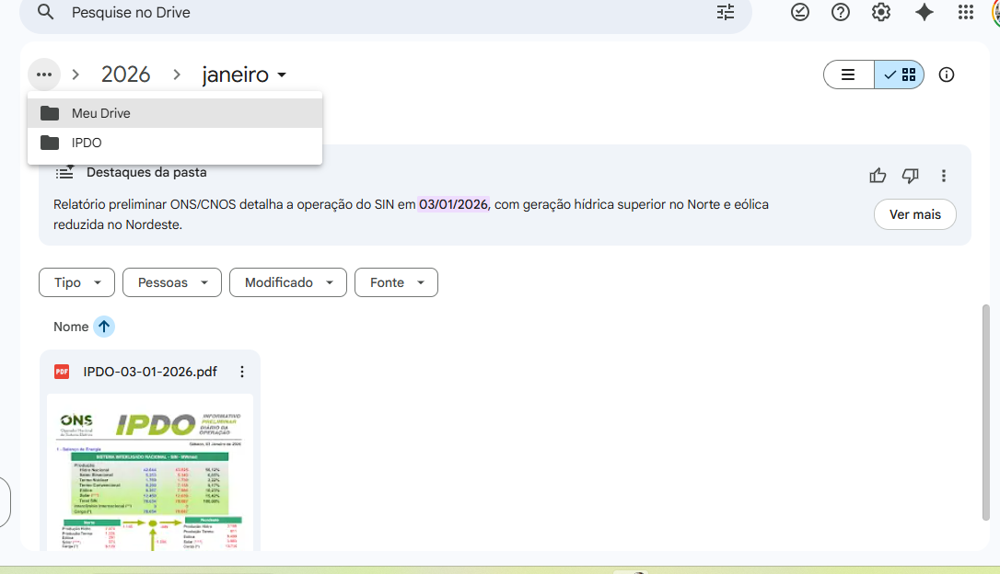

# 📊 Automação IPDO ONS — Notificação e Arquivamento Automático

Automação desenvolvida em **Python** para monitorar, processar e distribuir o  
**IPDO (Informe Diário de Operação)** publicado pelo **ONS**.

O robô executa de forma **100% automática em VPS**, sem dependência de computador local.

---

## 🎯 Objetivo da Automação

- Baixar automaticamente o **IPDO diário** no site do ONS
- Extrair os **Destaques da Operação — Submercado Nordeste**
- Enviar **e-mail HTML profissional** com resumo e PDF anexado
- Salvar o PDF no **Google Drive**, organizado por:
  

---

## 🧩 Tecnologias Utilizadas

- **Python 3**
- `requests` — download do PDF
- `pypdf` — leitura e extração de texto
- **Regex avançado** para parsing estruturado
- `smtplib` — envio automático de e-mails
- **Google Apps Script** — upload e organização no Google Drive
- **Linux (VPS Ubuntu)** — execução contínua
- **Cron** — agendamento automático

---

## 🔄 Fluxo da Automação

1. Acessa o acervo digital do ONS
2. Baixa o IPDO referente ao dia anterior
3. Localiza a seção **“4 - Destaques da Operação”**
4. Extrai exclusivamente o trecho do **Submercado Nordeste**
5. Formata os destaques em HTML profissional
6. Envia e-mail automático com:
   - Resumo estruturado
   - PDF IPDO anexado
7. Salva o PDF no Google Drive em:


---

## 📧 Exemplo do E-mail Recebido


---

## 📄 Exemplo do PDF IPDO


---

## 🗂️ Organização no Google Drive



---

## ⚙️ Execução

A automação roda em **VPS Linux**, de forma agendada via **cron**:

```bash
30 15 * * * python ipdo.py

  
